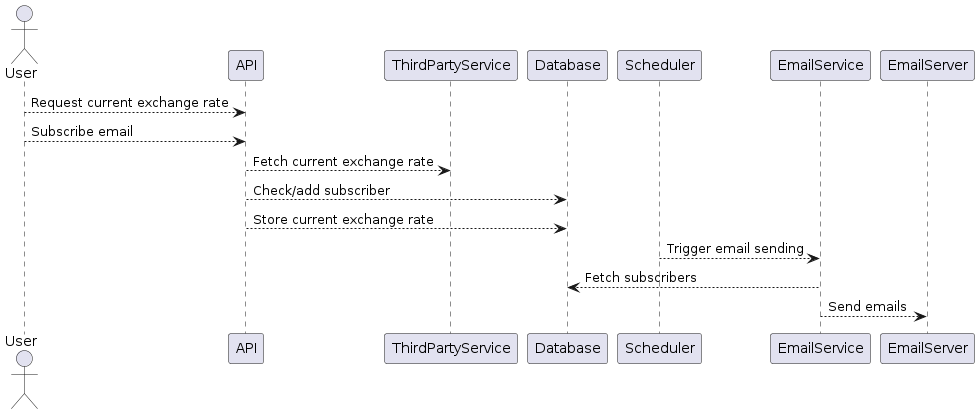

# Currency Exchange Rate Service

## Overview

This repository contains a service that provides the current exchange rate of USD to UAH and allows users to subscribe to daily email updates.

## Architecture Diagram



## Architectural Explanation

The service is designed following a **Service-Oriented Architecture (SOA)** paradigm. This architecture promotes a clear separation of concerns and allows for independent development, deployment, and scaling of individual components.

### Key Components

1. **API**:
   - Handles user requests for the current exchange rate and subscription management.
   - Communicates with third-party services to fetch exchange rates and stores/retrieves data from the database.

2. **ThirdPartyService**:
   - An external service providing current exchange rates. The API fetches data from this service.

3. **Database**:
   - Central storage for user subscriptions and exchange rates.

4. **Scheduler**:
   - A time-based service that triggers the email sending process daily.

5. **EmailService**:
   - Responsible for composing and sending emails to subscribed users.
   - Interacts with the database to get subscriber information and sends emails via an EmailServer.

## Getting Started

To run this project, you will need Docker and Docker Compose installed. Follow these steps to set up and run the project:

0. Prerequisites
   To run project:
   - Docker: 20.10.0 or later
   - Docker Compose: 1.27.0 or later

   To develop and test locally: 
   - Node.js: >=18.19.x
   - Yarn: 4.1.1

1. Clone the repository:
   ```sh
   git clone https://github.com/your-username/your-repository.git
   cd your-repository
   
2. Build and start the Docker containers:
   ```sh
   docker-compose up --build
   
3. The API will be available at http://localhost:8080
   
## API specification

// TODO
