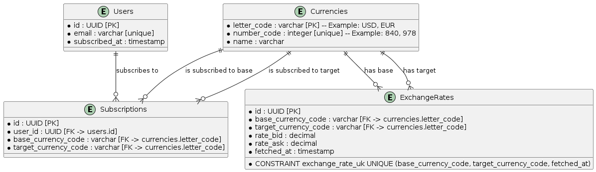

# Currency Exchange Rate Service

## Overview

This repository contains a service that provides the current exchange rate of USD to UAH and allows users to subscribe to daily email updates.

## Getting Started

To run this project, you will need Docker and Docker Compose installed. Follow these steps to set up and run the project:

0. Prerequisites
   To run project:
   - Docker: 20.10.0 or later
   - Docker Compose: 1.27.0 or later

   To develop and test locally: 
   - Node.js: >=18.19.x
   - Yarn: 4.1.1

   To be able to send over the emails:
   - Google account with an App password set up on https://myaccount.google.com/apppasswords


1. Clone the repository:
   ```sh
   git clone https://github.com/hrynS/currency-exchange-service.git
   cd currency-exchange-service
   
2. Build and start the Docker containers:
   ```sh
   docker-compose up --build
   
3. The API will be available at http://localhost:8080

### Try it out

1. Get USD currency rate in UAH 
   ```sh
   curl -X 'GET 'http://localhost:8080/rate' -H 'accept: application/json'
   
2. Subscribe with email 
   ```sh
   curl -X 'POST' 'http://localhost:8080/subscribe' \
   -H 'accept: application/json' \
   -H 'Content-Type: application/x-www-form-urlencoded' \
   -d 'email=subscribers.email@gmail.com'

### Business Logiс

1. **Requesting Current Exchange Rate**
   - When a user requests the current exchange rate, the service fetches the latest exchange rate from a third-party API and stores it in the `ExchangeRates` table if it doesn't already exist for the current timestamp.

2. **Subscribing to Updates**
   - Users can subscribe to updates for specific currency pairs by providing their email address. The service checks if the email already exists in the `Users` table. If not, it creates a new user. It then creates a new subscription in the `Subscriptions` table.

3. **Daily Email Updates**
   - A scheduled job runs daily to fetch the latest exchange rates and send emails to all subscribed users. The service retrieves all subscriptions and the latest exchange rates for each subscribed currency pair from the `ExchangeRates` table. It then composes and sends an email to each user with the relevant exchange rate information.

## Architecture Diagram


## Architectural Explanation

The service is designed following a **Service-Oriented Architecture (SOA)** paradigm. This architecture promotes a clear separation of concerns and allows for independent development, deployment, and scaling of individual components.

### Key Components

1. **API**:
   - Handles user requests for the current exchange rate and subscription management.
   - Communicates with third-party services to fetch exchange rates and stores/retrieves data from the database.

2. **ThirdPartyService**:
   - An external service providing current exchange rates. The API fetches data from this service.

3. **Database**:
   - Central storage for user subscriptions and exchange rates.

4. **Scheduler**:
   - A time-based service that triggers the email sending process daily.

5. **EmailService**:
   - Responsible for composing and sending emails to subscribed users.
   - Interacts with the database to get subscriber information and sends emails via an EmailServer.
   
## Database Schema



## API specification

// TODO
